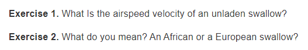

# HonKit plugin: exercise

Formats and numbers each exercise. Numbering is automatic and starts at 1. An
exercise can be labelled to allow for cross-referencing.

## Installation

Install via npm:

```sh
npm install honkit-plugin-exercise --save-dev
```

Add the plugin to your `book.json`:

```js
{
    plugins: [ "exercise" ]
}
```

## Usage

An exercise is added by the block:

```

Insert your exercise text here.
```

To help cross-reference an exercise, you can add a label. The label text should
not have any white spaces.

```

Insert your exercise text here.
```

For example, the following exercise blocks

```

What Is the airspeed velocity of an unladen swallow?


What do you mean? An African or a European swallow?
```

would be rendered as



Cross-reference an exercise like how you cross-reference a section in a Markdown
file. In the above example, the exercise having the label `"a_label"` can be
cross-referenced as:

```
[this exercise](/path/to/file.md#a_label)
```
